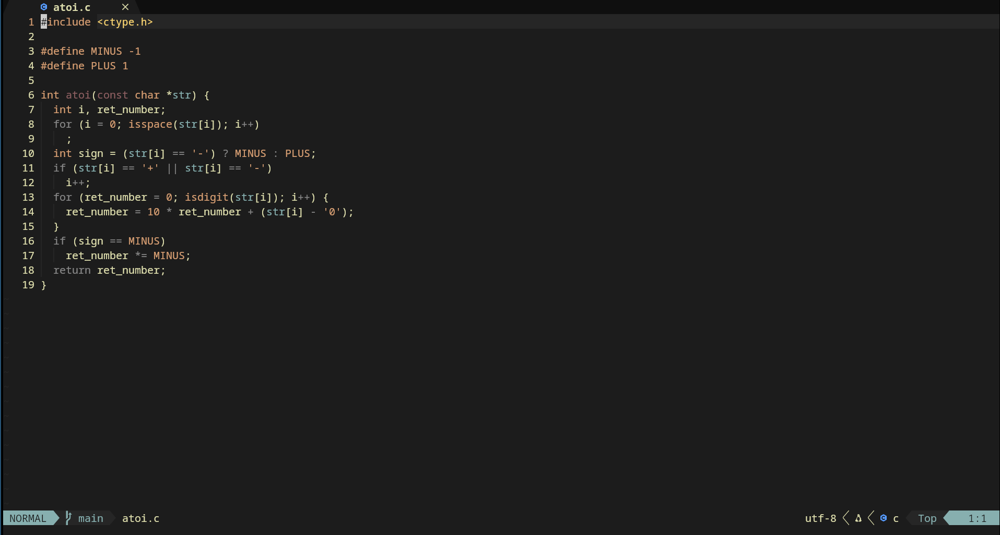

    <h1>Neovim config</h1>
    
    <h2>Special thanks</h2>

## ENG
- This repository based on *https://github.com/s3rgeym/nvim-config.git* (**s3rgeym**) thanks him very much.
- Link to his article with a detailed explanation of how to the config works *https://www.linux.org.ru/articles/development/17971323.*
## RU
- Этот репозиторий основан на *https://github.com/s3rgeym/nvim-config.git* (**s3rgeym**) спасибо ему большое
- Ссылка на его статью с детальным обьяснением работы конфига *https://www.linux.org.ru/articles/development/17971323.*
